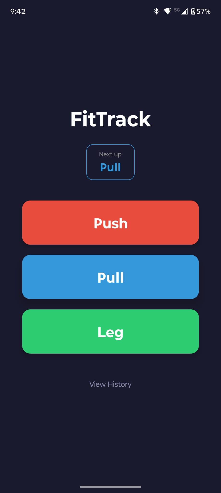
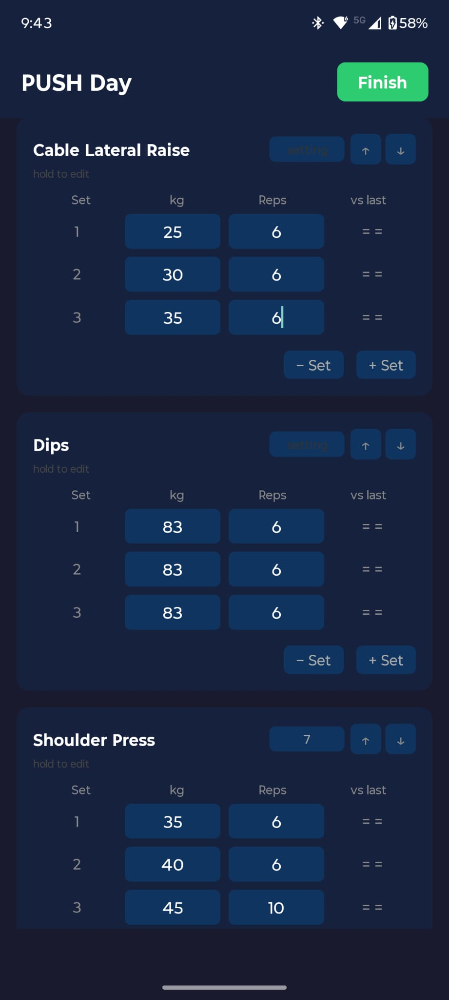
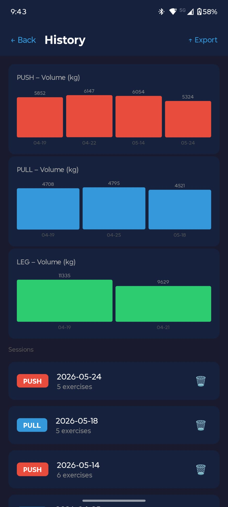

# FitTrack

[](https://expo.dev)
[](https://www.android.com)
[](LICENSE)

A minimalist Android workout tracker for Push / Pull / Leg training splits.  
Logs sets, weight and reps — shows progress against your last session at a glance.

---

## Screenshots

<p align="center">
  
  
  
</p>

<p align="center">
  <em>Split selection with next-up suggestion &nbsp;·&nbsp; Active workout tracking &nbsp;·&nbsp; Volume history & session log</em>
</p>

---

## Features

- **PPL split selection** — app suggests the next split based on PPL rotation
- **Per-set tracking** — log weight and reps for every set; compare against last session inline
- **Progress indicators** — ↑ ↓ = per set shows instantly whether you improved, dropped or held
- **Exercise management** — reorder via ↑↓ buttons, rename, or delete exercises; add custom ones
- **Machine setting field** — store seat/pin position per exercise directly on the card
- **Skip exercises** — tap exercise name to gray it out without removing it from the session
- **Workout draft** — in-progress workouts survive navigation away and come back intact
- **Leave guard** — alerts before discarding unsaved data
- **Exercise progress chart** — bar chart of best weight per session with first → latest diff
- **Volume history chart** — total session volume over last 10 sessions per split
- **Session history** — full log of past workouts with delete support
- **JSON export** — share all session data as a structured JSON file
- **Local-only storage** — all data stays on device via SQLite, no account required

---

## Tech Stack

| Layer | Technology |
|---|---|
| Framework | React Native (Expo managed, SDK 54) |
| Language | TypeScript |
| Storage | expo-sqlite v16 (SQLite, synchronous API) |
| Navigation | @react-navigation/native · native-stack |
| Export | expo-sharing · expo-file-system |
| Build | EAS Build (cloud APK) |

---

## Setup

**Requirements:** Node.js 18+, [Expo Go](https://expo.dev/go) (for development) or EAS CLI (for APK build)

```bash
# 1. Clone
git clone https://github.com/Sildex/FitTrack.git
cd FitTrack

# 2. Install dependencies
npm install

# 3. Start dev server
npx expo start
```

Scan the QR code with Expo Go to run on your Android device.

### Build APK

```bash
npm install -g eas-cli
eas login
eas build -p android --profile preview
```

---

## Project Structure

```
FitTrack/
├── src/
│   ├── data/
│   │   ├── database.ts        # All SQLite operations
│   │   ├── defaultExercises.ts # Pre-loaded exercise list
│   │   └── workoutDraft.ts    # In-memory draft store
│   ├── navigation/
│   │   └── AppNavigator.tsx   # Stack navigator + param types
│   ├── screens/
│   │   ├── SplitSelectScreen.tsx
│   │   ├── WorkoutScreen.tsx
│   │   ├── SummaryScreen.tsx
│   │   ├── HistoryScreen.tsx
│   │   └── ExerciseProgressScreen.tsx
│   └── types/
│       └── index.ts           # Shared TypeScript types
├── assets/                    # App icons and images
├── docs/                      # Architecture and use-case documentation
├── App.tsx                    # Entry point — DB init + navigator
├── app.json                   # Expo config
└── eas.json                   # EAS Build profiles
```

---

## Notes

- Workout drafts are held in memory — they survive navigation but not a full app kill
- The `private/` folder is gitignored — used for personal notes and dev tooling
- All data is stored locally in SQLite; no backend or account required

---

*Personal project — not licensed for redistribution.*
